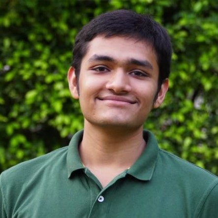

---
# Feel free to add content and custom Front Matter to this file.
# To modify the layout, see https://jekyllrb.com/docs/themes/#overriding-theme-defaults

layout: home
title: About Me
---

<!-- ### **Education** ###
1. B.Tech. in Electrical Engineering (2020 - 2024) 
Indian Institute of Technology Bombay (Mumbai, India) -->

{:height="250px" width="250px"}

Hi there, I am Shivam, a humble junior in the Electrical Engineering Department at IIT Bombay. I am also pursuing a minors in Artificial Intelligence.

I love playing with numbers and working on tough probability puzzles. This interest manifests into a love for Statistics, Machine Learning and algorithm design.   

Some relatively non-academic things about me - 
* I am also an avid birdwatcher, and spend most of my winter sunday mornings at the nature park with a pair of binoculars and the Helm Guide.
* I also play tabla and harmonium occasionally.   
* Once a chessmaster and a tournament swimmer.  
* Quite a philosopher myself. Speak 4 languages. 
* Ran 3 marathons

You can find me at _388, Hostel 3, Students' Residential Road, IIT Bombay, 400076_. 

Please read my [CV](docs/200070077-resume.pdf) or look at my [projects](/projects) to know about my work and achievements.
