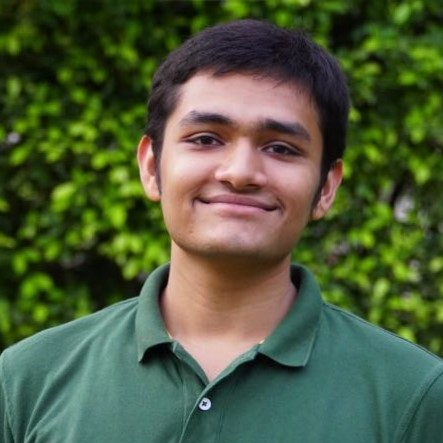

---
# Feel free to add content and custom Front Matter to this file.
# To modify the layout, see https://jekyllrb.com/docs/themes/#overriding-theme-defaults

layout: home
title: About Me
permalink: /about
order: 1
---

<!-- ### **Education** ###
1. B.Tech. in Electrical Engineering (2020 - 2024) 
Indian Institute of Technology Bombay (Mumbai, India) -->

{:height="250px" width="250px"}

Hi there, I'm Shivam, a humble junior in the [Electrical Engineering Department](https://www.ee.iitb.ac.in/web) at [IIT Bombay](https://www.iitb.ac.in/). I am also pursuing a minors in Artificial Intelligence.

I love playing with numbers and working on tough probability puzzles. This interest manifests into a love for Statistics, Machine Learning and algorithm design. 

I have had the great chance of working under [Prof. Sandeep Juneja](https://www.tcs.tifr.res.in/~sandeepj/) at the [Tata Institute of Fundamental Research](https://www.tifr.res.in/). Our research was mainly focused around climate modelling using algorithms, and some high level stochastic climatological physics. I explored various algorithms that are(/can be) used for climate prediction at various time scales. 

I also worked as an Artificial Intelligence intern in the research labs at [Reliance ltd](https://www.ril.com/). I worked in the telecomm wing of the conglomerate on 'Optimizing Electronic Tilt for Reduced Call Latencies in Directional Antennas'. 
<!-- 3. (https://www.jioinstitute.edu.in/research-overview)  -->

Some relatively non-academic things about me - 
* I am an avid birdwatcher, and spend most of my winter sunday mornings at the nature park with a pair of binoculars and the Helm Field Guide.
* I also play tabla and harmonium occasionally.   
* Once a chessmaster and a tournament swimmer.  
* Quite a philosopher myself. Speak 4 languages. 
* Ran 3 marathons.

#### News
> * October 2020 - Got accepted into IIT Bombay 

You can find me at _388, Hostel 3, Students' Residential Road, IIT Bombay, 400076_. 

Please read my [CV](files/cv_iitb.pdf) or look at my [projects](/projects) to know about my work and achievements.
