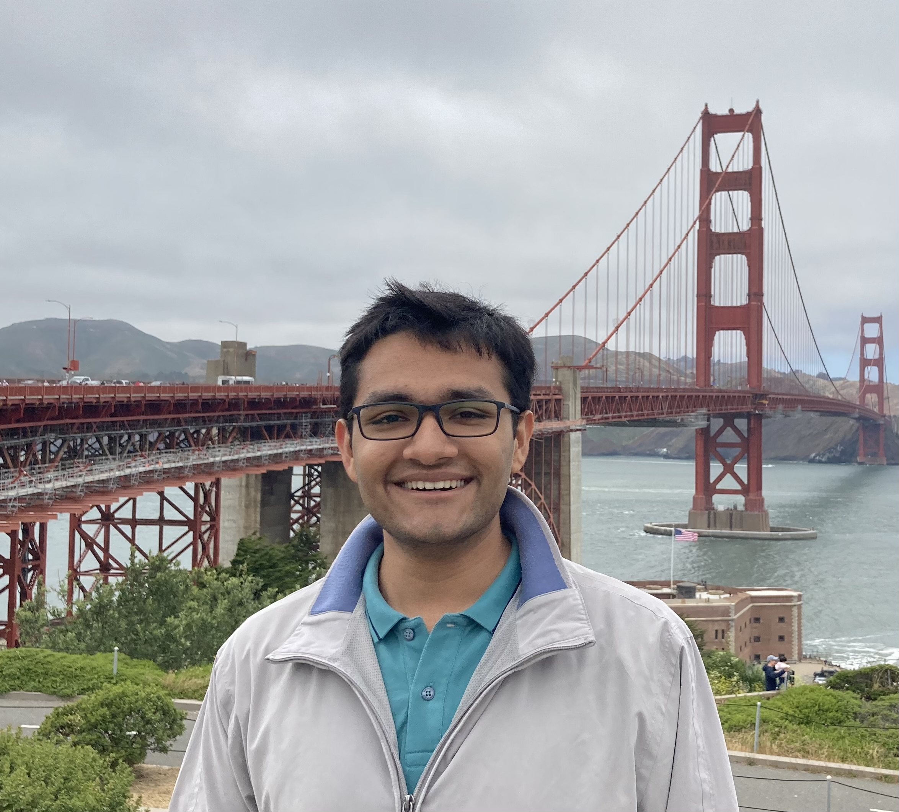

---
# Feel free to add content and custom Front Matter to this file.
# To modify the layout, see https://jekyllrb.com/docs/themes/#overriding-theme-defaults

layout: home
title: About Me
order: 1
---

<!-- ### **Education** ###
1. B.Tech. in Electrical Engineering (2020 - 2024) 
Indian Institute of Technology Bombay (Mumbai, India) -->

{:height="250px"}

_Welcome to my homepage._   

Hi there, I'm Shivam, a senior in the Electrical Engineering Department at [IIT Bombay](https://www.iitb.ac.in/). I am also pursuing a minor in Artificial Intelligence.

I love playing with numbers and working on probability puzzles. This interest manifests into a love for Statistics, Learning Theory and algorithm design. 

I consider myself fortunate to be working with Prof. Vivek Borkar for my Bachelors Thesis Project. My initial thesis work is under review at _IEEE SPCOM 2024_.   

I spent the last summer at the beautiful [USC](https://www.usc.edu) [Viterbi School of Engineering](https://viterbischool.usc.edu) working with [Prof. Meisam Razaviyayn](https://sites.usc.edu/razaviyayn/) on fair ML. My research was supported by the [IUSSTF-Viterbi](https://iusstf.org/iusstf-viterbi-program) research grant by the Government of India. Our work "f-FERM: A Scalable Framework for Robust Fair Empirical Risk Minimization" will appear at The Twelfth International Conference on Learning Representations ([**ICLR 2024**](https://iclr.cc)). An initial version was presented at the 15th [**OPT-ML Workshop**](https://opt-ml.org), [**NeurIPS 2023**](https://neurips.cc). Please read more on [arXiv](https://arxiv.org/abs/2312.03259).  
 

Some relatively non-academic things about me - 
* I am an avid birdwatcher, and spend most of my winter Sunday mornings at the nature park with a pair of binoculars and the Helm Field Guide.
* I also play tabla and harmonium occasionally.
* Quite a philosopher myself. Speak 4 languages. 

Please read my [CV](/cv) or look at my [projects](/projects) to know about my work and interests.  

