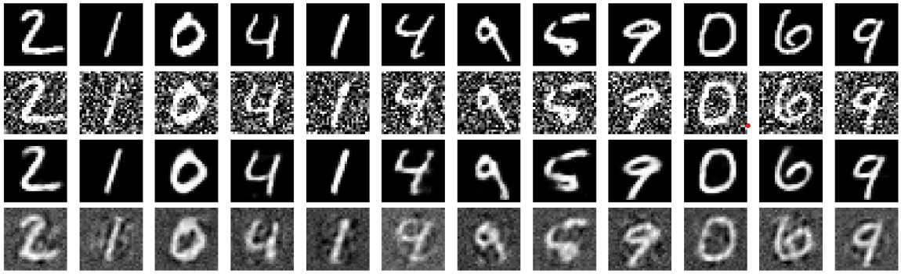

You can find my projects here. 
Link to IITB RISC [project](pages/IITB_RISC.md)

## Course Projects
1. **Autoencoder Architectures for Image Colorization and Noise Reduction**
   _DS303, Introduction to Machine Learning, [Prof. Biplab Banerjee](https://biplab-banerjee.github.io/)_
 {:width="500px"}
  Implemented autoencoder architectures for colorizing images and robust noise reduction in gaussian and salt-pepper noise images.

2. **Machine Learning for COVID-19 Data Analysis**  
  _DS203, Programming for Data Science, [Prof. Amit Sethi](https://www.ee.iitb.ac.in/~asethi/), [Prof. Manjesh Hanawal](https://www.ieor.iitb.ac.in/files/faculty/mhanawal/index.html)_
 * Obtained an R2 score of 0.854 on total COVID-19 casualty prediction using regularized linear models
 * Performed Hypothesis Testing by utilising the χ2 Contingency Test to validate the influenceof medical parameters on the ICU admission of any patient, across all age groups and chronic illnesses
 * Implemented Multilayer Perceptron Neural Net to predict the need of ICU admission of any patient based on blood and body parameters, obtaining a prediction Accuracy of 90.65% , with an F1-Score of 0.905

3. **IITB-RISC Microprocessor Design**
  _EE309, Microprocessors, Prof. Virendra Singh_
 * Designed an 8-register, 16-bit RISC microprocessor with a Turing complete 17 instruction ISA in VHDL
 * Developed the flowcharts and datapath structure for single and multicycle models from scratch
 * Simulated the designed microprocessor models on Cyclone-IVE FPGA, implemented on Quartus software
 * Utilised data forwarding and stalling techniques in six stage pipelined microprocessor to obtain a near perfect cycles per instruction ratio of unity, with clock rate adjusted to maximum time consuming step

## Other Projects 
1.**Visualising Deep Neural Networks**
  _Winter in Data Science | Analytics Club_
 * Explored Attribution Approach for interpreting Deep Neural Networks, with a qualitative focus on image recognition neural architectures, by acquiring ground truth labels and studying the model activation maps
 * Studied the applications of Class Activation Maps, Occlusion Sensitivity Maps and Saliency Maps to visualise CNN functioning for intuitive understanding of various image classification and detection algorithms
